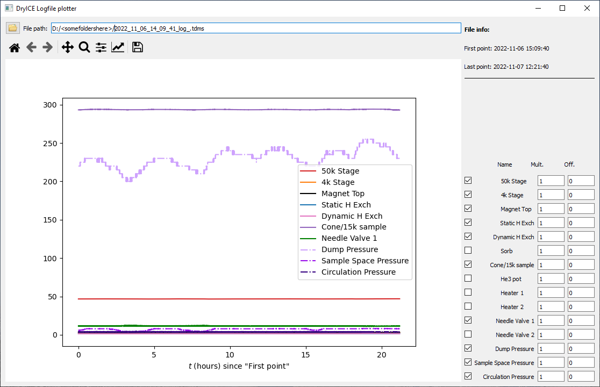

# DryICE-Logfile-Plotter
A Python GUI to convert .tdms logs to .csv files and subsequentially plot the results.
This software has been developed to easily plot logfiles generated by a ICEoxford VTI system.

## Description
This tool can be used for two things. If a .tdms logfile is selected, the software will
* convert the data into a .csv file (if such file has not already been created)
* subsequentially plot the generated data

## Features
After the data has been converted, the data will be plotted. A screenshot of the software is shown below:

The software has the following features:
* If a data channel only contains zeros, it will be unchecked and thus will not be visible in the plot

For each data channel, you can modify its data:
* The checkbox can enable or disable plotting this channel
* The **mult.** factor multiplies the data by the value specified in the text box (Hit _return_ on the keyboard to confirm the number)
* The **off.** factor adds an offset (from the text box) to the data

Modifying the values of these two text boxes can make it easier to overlay / compare data.

## Requirements
* This software requires the nptdms module (pip install nptdms)
* All files should be downloaded and the script should run from the root folder

## Known issues
* Timezone is not taken into account, so displayed time (first / last point) may differ from actual time (as is confirmed in the screenshot when comparing the filename timestamp and the 'first point' timestamp).
